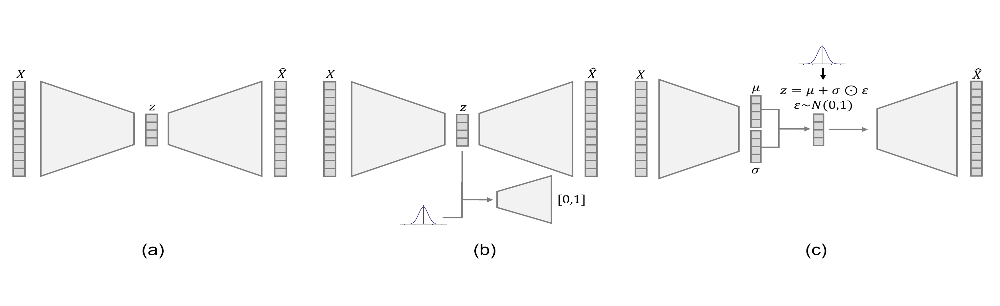

Often, data can be naturally described via multiple views or modalities. For example, we could consider an image and the corresponding text as different modalities. These modalities contain complementary information which can be modelled jointly using multi-view methods. The joint modelling of multiple modalities has been explored in many research fields such as medical imaging [@Serra2018], chemistry [@Sjostrom1983], and natural language processing [@Sadr2020]. 

Autoencoders are unsupervised generative models which learn low dimensional latent representations of complex data. The autoencoder framework consists of two mappings; the encoder which embeds information from the input space into a latent space, and a decoder which transforms point estimates from the latent space back into in the input space. Autoencoders have been successful in downstream tasks such as classification [@Creswell2017], outlier detection [@An2015], and data generation [@Wei2020]. 

There exist many software frameworks for extending autoencoders to multiple modalities. Generally, this involves learning separate encoder and decoder functions for each modality with the latent representations being combined or associated in some way. By far the most popular group of multi-view autoencoder models are multi-view extensions of Variational Autoencoders (VAEs) where the latent space is regularised by mapping the encoding distributions to a gaussian prior using a Kullback–Leibler (KL) divergence term. However, there are also other multi-view autoencoder frameworks, such as multi-view Adversarial Autoencoders (AAEs) [@Wang2019]. Here the latent space is regularised by mapping the encoding distribution to a prior (here a gaussian) using an auxiliary discriminator tasked with distinguishing samples from the posterior and prior distributions. The choice of AAE or VAE model may be influenced by various elements of the application process. For example, the encoding distribution which best describes the data or stability during training may impact the choice of model.



Even within these regularisation frameworks there are vast modelling differences to be considered when choosing the best model for the task at hand. \autoref{fig:AElatent} depicts two latent variable models for modelling two views of data; $X$ and $Y$. \autoref{fig:AElatent}a shows the joint latent variable model [@Suzuki2022] where both views, $X$ and $Y$, share an underlying factor. The latent variable model in \autoref{fig:AElatent}b shows a coordinated model [@Suzuki2022], which assumes some relationship between the latent variables, $z_x$ and $z_y$ of $X$ and $Y$ respectively. Which latent variable model is most appropriate depends on the desired outcome of the learning task. Example multi-view autoencoder frameworks built for these two latent variable models are given in \autoref{fig:AEexample}.


![Example frameworks of a two-view autoencoder for data $X$ and $Y$ for a (a) joint model, where the individual latent spaces are combined and the reconstruction is carried out from the joint latent space, and a (b) coordinated model [@Suzuki2022], where the latent representations are coordinated either by cross view generation or an addition loss term for association between the latent variables.\label{fig:AEexample}](../figures/joint_coordinated_models.png)

Given the large number of multi-view autoencoders and versatility of architecture, it is important to consider which model would best suit the use case. `multi-view-AE` is a Python library which implements several variants of multi-view autoencoders in a simple, flexible, and easy-to-use framework. We would like to highlight the following benefits of our package. 

Firstly, the `multi-view-AE` package is implemented with a similar interface to `scikit-learn` [@sklearn_api2013] with common and straight-forward functions implemented for all models. This makes it simple for users to train and evaluate models without requiring detailed knowledge of the methodology. Secondly, all models follow a modular structure. This gives users the flexibility to choose the class (such as the encoder or decoder network) from the available implementations, or to contribute their own. As such, the `multi-view-AE` package is accessible to both beginners, with off-the-shelf models, and experts, who wish to adapt the existing framework for further research purposes. Finally, the `multi-view-AE` package uses the `PyTorch-Lightning` API which offers the same functionality as raw `PyTorch` in a more structured and streamlined way. This offers users more flexibility, faster training and optimisation time, and high scalability.

# Statement of need
Multi-view autoencoders have become a popular family of unsupervised learning methods in the field of multi-view learning. The flexibility of the form of the encoder and decoder functions, ease of extension to multiple views, generative properties, and adaptability to large scale datasets has contributed to the popularity of multi-view autoencoders compared to other multi-view methods. Subsequently, multi-view autoencoders have used to address challenges across a range of fields; such as anomaly detection from videos [@Deepak2021] or cross-modal generation of multi-omics data [@Minoura2021].

There exist many different multi-view autoencoder frameworks with the best method of choice depending on the specific task. Existing code is often implemented using different Deep Learning frameworks or varied programming styles making it difficult for users to compare methods. The motivation for developing the `multi-view-AE` library is to widen the accessibility of these algorithms by allowing users to easily test methods on new datasets and enable developers to compare methods and extend code for new research applications. The modular structure of the `multi-view-AE` library allows developers to choose which element of the code to extend and swap out existing Python classes for new implementations whilst leaving the wider codebase untouched.

There exists, as far as we are aware, no Python library that collates a large number of multi-view autoencoder models into one easy to use framework. The `Pixyz` library [@Suzuki2021] is probably the closest relative of `multi-view-AE`, implementing a number of multi-view autoencoder methods. However, `Pixyz` is designed for the wider field of deep generative modelling whereas `multi-view-AE` focuses specifically on multi-view autoencoder models. As such `multi-view-AE` builds upon `Pixyz`'s multi-view offering providing a wider range of multi-view methods.

# Software description
## Software architecture
Following the `scikit-learn` interface, to train a multi-view autoencoder model with the `multi-view-AE` package, first a model object is initialised with relevant parameters in an easy-to-configure file. Next, the model is trained with the ```fit()``` method using the specified data. Following fitting, the saved model object can be used for further analysis: predicting the latent variables, using ```predict_latent()```, or data reconstructions, using ```predict_reconstruction()```.

All models are implemented in `PyTorch` using the `PyTorch-Lightning` wrapper.

## Parameter settings
The `multi-view-AE` package uses the Hydra API for configuration management. Most parameters are set in a configuration file and are loaded into the model object by `Hydra`. The combination of Hydra with the modular structure of models in the `multi-view-AE` package, makes it easy for the user to replace model elements with, either other available implementations or their own by editing the relevant section of the configuration file.

## Implemented models
A complete model list at the time of publication:

| Model class      | Model name           | Number of views |
| ------------- |:-------------:| -----:|
| mcVAE      | Multi-Channel Variational Autoencoder (mcVAE) [@Antelmi2019] | >=1 |
| AE      | Multi-view Autoencoder    |   >=1 |
| AAE | Multi-view Adversarial Autoencoder with separate latent representations     |    >=1 |
| DVCCA | Deep Variational CCA [@Wang2016] |    2 |
|  jointAAE    | Multi-view Adversarial Autoencoder with joint latent representation  |   >=1 |
| wAAE | Multi-view Adversarial Autoencoder with joint latent representation and Wasserstein loss    |    >=1 |
|  mmVAE    | Variational mixture-of-experts autoencoder (MMVAE) [@Shi2019] |   >=1 |
| mVAE | Multimodal Variational Autoencoder (MVAE) [@Wu2018] |    >=1 |
| me_mVAE | Multimodal Variational Autoencoder (MVAE) with separate ELBO terms for each view [@Wu2018] |    >=1 |
| JMVAE |  Joint Multimodal Variational Autoencoder(JMVAE-kl) [@Suzuki2016] |    2 |
| MVTCAE | Multi-View Total Correlation Auto-Encoder (MVTCAE) [@Hwang2021] |    >=1 |
| MoPoEVAE |  Mixture-of-Products-of-Experts VAE [@Sutter2021] |    >=1 |
| mmJSD |  Multimodal Jensen-Shannon divergence model (mmJSD) [@Sutter2021b] |    >=1 |


## Documentation
Documentation is available (https://multi-view-ae.readthedocs.io/en/latest/) for the `multi-view-AE` package as well as tutorial notebooks. These resources serve as both guides to the `multi-view-AE` package and educational material for multi-view autoencoder models.

# Acknowledgements
We would like to thank Thomas Sutter, HyeongJoo Hwang and, Marco Lorenzi, and Brooks Paige, for their help understanding the Mixture-of-Product-of-Experts VAE [@Sutter2021] and mmJSD [@Sutter2021b], MVTCAE [@Hwang2021], mcVAE [@Antelmi2019], and MMVAE [@Shi2019] models, respectively.  

ALA and NMB are supported by the EPSRC-funded UCL Centre for Doctoral Training in Intelligent, Integrated Imaging in Healthcare (i4health) and the Department of Health’s NIHR-funded Biomedical Research Centre at University College London Hospitals. AJ is supported by the Engineering Mathematics and Computing Lab (EMCL), Heidelberg University, the Helmholtz Association under the joint research school "HIDSS4Health – Helmholtz Information and Data Science School for Health", and the Heidelberg Institute for Theoretical Studies (HITS).
