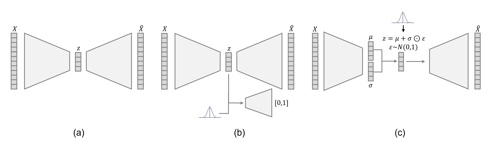
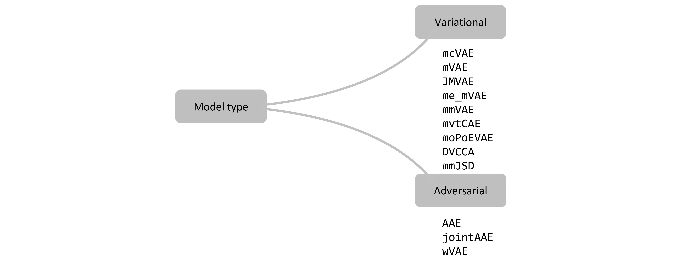
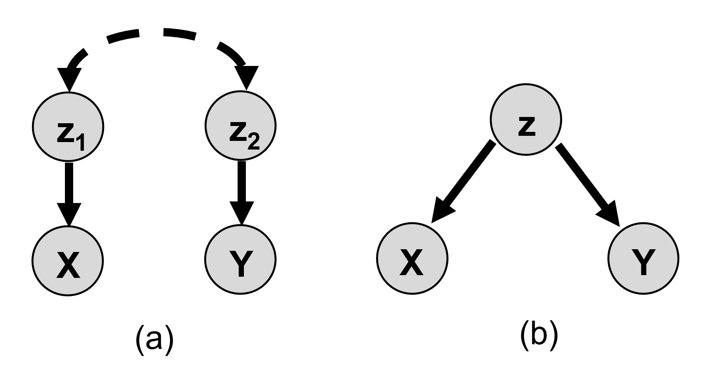

Model frameworks
================

There is one vanilla multi-view autoencoder framework, the ``AE`` model. The remaining models can be grouped into adversarial and variational models which are models regularised by matching the aggregate or marginal encoding distributions, respectively, to a prior distribution. The figure below shows the frameworks for the (a) vanilla autoencoder (b) adversarial autoencoder and (c) variational autoencoder for a single view.

   
   .. 
   
The figure below shows the adversarial and variational groupings of models within the ``multiviewAE`` framework.

   ..
   
When extending autoencoders to multiple views, we can assume two latent models. The figure below shows the latent model for (a) a coordinated model which assumes separate latents for each view which are associated with each other and (b) a joint model which assumes a shared latent across views for data X and Y.

   ..